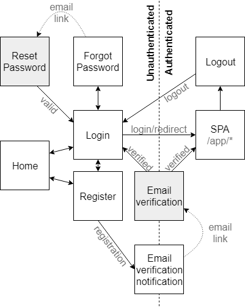
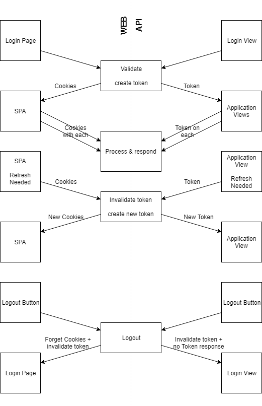

# Authentication Flow

This document aims to extensively explain the authentication flow of the TravelCompanion application. This document will go over following points:

* [Overview](https://github.com/iw-dbti-2016/travel-companion-web/blob/master/docs/flow/auth-flow.md#overview)
* [Home and SPA](https://github.com/iw-dbti-2016/travel-companion-web/blob/master/docs/flow/auth-flow.md#home-and-spa)
* [Registration](https://github.com/iw-dbti-2016/travel-companion-web/blob/master/docs/flow/auth-flow.md#registration)
* [Email Verification](https://github.com/iw-dbti-2016/travel-companion-web/blob/master/docs/flow/auth-flow.md#email-verification)
* [Login](https://github.com/iw-dbti-2016/travel-companion-web/blob/master/docs/flow/auth-flow.md#login)
* [Password Reset](https://github.com/iw-dbti-2016/travel-companion-web/blob/master/docs/flow/auth-flow.md#password-reset)
* [Logout](https://github.com/iw-dbti-2016/travel-companion-web/blob/master/docs/flow/auth-flow.md#logout)

## Overview

Figure 1 shows an overview of the complete authentication flow. All sections below discuss this figure.

The boxes on this diagram represent pages, or rather endpoints of the system. Some endpoints will result in their own view being shown, others will redirect the user to a different endpoint after running some logic. The arrows indicate the possible paths a user can follow/be sent through. Some arrows are accompanied by clarifying text. These are the involuntary transitions. The user can not choose these paths, they are imposed by the backend. The arrows without accompanying text represent a user's actions (i.e. clicks on links).

From top to bottom in the diagram is a striped line. This line seperates the pages where a user has to be authenticated from the pages where a user must be unautenticated. Some pages are located on the line to signal that they accept both authenticated and unauthenticated users to visit. The main part of the application that requires a user to be authenticated is the `SPA` of 'Single Page Application,' which is the bulk of the application. Note that the diagram indicates that all routing in the `SPA` will occuring with a `/app/`-prefix (e.g. `/app/username/trips`) to clearly distinguish this part of the application from the rest.

Every part of this diagram will be discussed in detail in the following sections.

*Figure 1: The complete authentication flow in a diagram. The striped line seperates the pages where a user has to be authenticated from the pages where the user may not be authenticated. Some pages allow both and are located on the line. Arrows without clarifying text represent a visitor's clicks. Arrows with clarification are performed by the system. Every part of the diagram will be discussed in the sections below.*

Figure 2 shows an overview of the token-protocol(s). The figure is split into two once again. This time, the left side shows the protocol for the web-application and the right side the protocol for the API. The figure shows three scenarios in which a token is created or destroyed. At the top there is the login, in the middle the refreshing of a (valid) token and at the bottom the logout. The rectangles in the center (on the line) represent the server and the boxes at the sides are the clients, be it via web or API.

The main distinction between the web and the API is the transportation method of the token. The token itself is the same kind, [JWT](https://jwt.io/) with the `HS512` algorithm used for signing the token. Clients in the web-environment will receive their token via cookies (multiple). Clients connected via the API will receive their token in the JSON-response after a request.

The reason for this distinction is safety. While a token can be stored safely in a native app, the storage in browsers is not that secure, and very much susceptible for XSS-attacks. LocalStorage is not safe enough to store the authentication-tokens. Therefore the token is split into two parts. The 'payload' including the token header and payload, and the 'sign' including the token signature. These parts will both be stored in one cookie. The payload-cookie is not httpOnly, so JavaScript has access to the base64-encoded payload in case this is needed. The signature is stored in a httpOnly cookie, so JavaScript never has access to this part of the token. Upon sending a request to the server, the cookies will be extracted into the full JWT-token and the user has identified themselve. Note that these cookies both have following properties: sameSite: strict (CSRF prevention), secure: true (not in development, certainly in production).

When sending a login-request to the server, with valid credentials, the server will create a token and respond properly (i.e. set cookies for browser and redirect the user and add the token in the API-response). On subsequent requests, the API-user has to include the `Authorization`-header on every request. In the browser, the cookies will be sent automatically so no extra work is required. **We're looking into additional CSRF protection, as at this point only 87% of internet users use browsers that support the SameSite flag for cookies (wich is proper CSRF protection)**.

When the token is about to expire (this will happen after a period between one week and one month, **TBD, considering safety and UX**), the client has to request a refreshing of the token. This is the same as a request to a different resource, only to another endpoint. Upon hitting that endpoint with valid autentication (the token cannot be already expired at the point of refreshing, in that case the user has to relogin) the server will invalidate the current token and create a new token. The new token will then be returned in the proper way (overwrite cookies for web, included in response for API).

When logging out from the web, the user is redirected to the logout-endpoint, the token is invalidated and the cookies are removed. The user is than redirected to the login-page. For the API, the application is responsible for a small part of the work. The request is as usual, and the token will be invalidated and a response will indicate that the user has been logged out properly (read: token has been successfully destroyed). The application is now responsible for removing all stored and cached data on the device (including the token) and redirecting the user to the login-view.

The discussion of other requests is written in the [Authentication Flow Clients](./auth-flow-clients.md).

*Figure 2: The token protocol. This figure is split into two, the left side showing the protocol for the web-application, the right side showing the protocol for the API. The figure shows three scenarios in which a token is modified: at the top the login, in the middle the refreshing of a token and at the bottom the logout. The boxes in the center are the server and the boxes at the sides are the client, be it web or API.*

## Home and SPA

We start by taking a look at the homepage and the `SPA`.

The homepage is a simple onepager with all the info about the project and possibly the features and other 'stuff,' the contents of this page are not important for the auth-flow and will thus be discussed elsewhere (or not at all).

The `SPA` represents the bulk of the application. It is the main front-end of the 'interesting' (from user's perspective) content. Going with a Single Page Application allows us to use a single API for both the web and the apps, which is easier for development. A user can only access this page when authenticated and when they've verified their email. Otherwise the user will be redirected to the login page or to the `Email Verification Notification`-page. When a user hasn't visited for a long time, their token might be invalid. This will be noticed on the first request (i.e. when loading the first data for the page, so no data has been exposed at that point), whereafter the user will be redirected to the login-page.

## Registration

When registering a user and supplying invalid information, an error will be returned. The errors will show up in the browser view or be returned in the JSON-reponse.

When supplying valid information, a database record will be created for the new user. A token is generated and returned in JSON (API) or cookies (web). The user is shown an email verification notification, stating the he or she has to verify their email by clicking a link in an email they received. As long as this proces is not completed, they cannot access any data in their account.

## Email Verification

If a user leaves after registration and returns after a period and tries to log in once again, the notice will reappear. This will happen as long as their email is not verified.

The verification itself may be done while being logged in or out. When registering on the web, a user is logged in on registration an will thus probably be logged in when verifying their email. When registering on the app, the user clicks the link in their email and will be redirected to the browser, where they're logged out (verification is thus only possible in the browser).

On successful verification, the user is redirected to either the `SPA` (logged in) or the login-page (logged out) where an appropriate message is shown. In the app, the user can click a refresh button to retry their access (which is denied when the email is not verified). Later, the refreshing might be replaced by a pusher/socket.io realtime connected, by pushing the verification-event to the device and making the device refresh by itself.

## Login

When trying to log in with wrong credentials, the user will be notified properly, through the response (API) or error messages in the form (web).

When logging in with correct credentials, a token will be generated and returned to the user. In the web, cookies will be set as discussed above and the user is redirected to the `SPA`. When logging in through the API, the token will be returned in the response. Subsequent requests can now be made by supplying the received token (also discussed above).

## Password Reset

When a user forgets their password, it can be reset. To do so, the user has to be logged out. Changing a password while being logged in is a different process that will obviously also be possible. A request with an email can be sent from the web or API to reset the password. If the email is linked with a valid account, an email with password-reset-link will be sent to that email.

When clicking this link in their email, the user will be redirected to the browser (i.e. this part is only possible in the browser, not the API). After verifying the correctness of the link, the user is shown a form for changing their password. After changing the password, the user is redirected to the login-page and they can immediately log in with the new password, also via the API.

Requesting a password-reset, but letting the link in the email expire does not result in any action.

## Logout

Logging out is easy for the user. They only have to click a button. When logging out from the web, the cookies will be deleted and the user is redirected to the login-page. Via API, the token is destroyed and a confirmation is returned. The application using the API is responsable for clearing all user-data and cache and certainly the token and then redirecting the user to the login-page.
